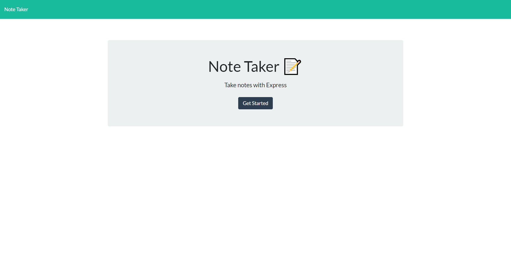
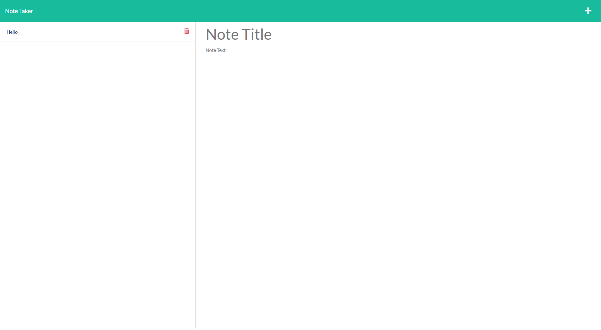

# Module-11-Challenge-Note-Taker-Application-using-Express.js
Note Taker Application built using Express.js

 ## User Story
AS A small business owner
 
I WANT to be able to write and save notes
 
SO THAT I can organize my thoughts and keep track of tasks I need to complete

 ## Live Link
 [Live App Link](https://notes-taker-express-app-cda00bf6b955.herokuapp.com/)

 ## Description

 This project takes your notes and saves as a list you can access and delete them anytime you want.

 ## Installation

 Install the following:
  
 npm install node.js
  
 npm install express.js, uuid
  

 ## Website Preview
 

 

 ## License

 

 This project is licensed under the [MIT License](https://choosealicense.com/licenses/mit/) license.

 ## Contributing

 Pull requests are most welcome

 ## Queries

 GitHub: https://github.com/jmorris38

 Email: jmorris38@outlook.com
